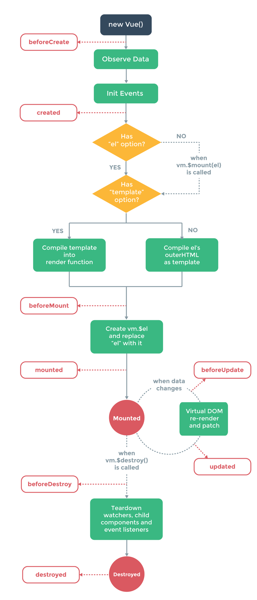

# Vue.js
## Syntax

#### template

###### Dom transform - {{ }}
```html
<p> {{ message }} </p>
```

###### 2-way binding - v-model
```html
<input type="text" v-model="message">
```

###### Visibility - v-show
Use data
```html
<p v-show="isShowMessage"> {{ message }} </p>
```
Or using direct condition
```html
<p v-show="message.length"> {{ message }} </p>
```
If v-show = false, it'll add **display: none;** style

###### Click event - @click
```html
<button @click="changeMessage">Click me!</button>
```
###### Key up event - @keyup
```html
<input @keyup="handleKeyUp" />
```

```javascript
method: {
  handleKeyUp(e) {
    console.log(e.keyCode, e.key);
  }
}
```

Or using [Keycode](https://vuejs.org/v2/guide/events.html#Key-Codes)
```html
<input @keyup.esc="handleKeyUp" 
       @keyup.enter="handleKeyUp" 
       @keyup.tab="handleKeyUp" 
       @keyup.delete="handleKeyUp" 
       @keyup.esc="handleKeyUp" 
       @keyup.space="handleKeyUp" 
       @keyup.up="handleKeyUp" 
       @keyup.down="handleKeyUp" 
       @keyup.left="handleKeyUp" 
       @keyup.right="handleKeyUp" 
 />
```
###### Mouse event - @mouseenter, @mouseleave
```html
<input @mouseenter="handleMouse"
       @mouseleave="handleMouse"
/>
```
###### Condition - @v-if, @v-else
```html
<h5 v-if="message.length">If condition</h5>
<h5 v-else>Else condition</h5
```
If false, it'll **remove dom element**

###### Binding to attributes or css - v-bind: (or :)
Use can use both **v-bind:** and **:**  
1. binding directly
```html
<input :class="{'input-error-class': messange.length > 255}">
```
2. using computed
```html
<input :style="inputErrorStyle">
```
```javascript
computed: {
  inputErrorStyle(): {
    if (this.message.length > 255)
      return {
        'border': '1px solid red',
        'color': 'red'
      }
  }
}
```

#### script
```javascript
export default {
  data() { 
    return {
      message: "This is a message",
      isShowMessage: true
    }
  },
  methods: {
    changeMessage() {
      this.message = "This method will change message content";
    }
  },
  computed: {
    revesedMessage() {
      return this.message.split('').reverse().join('');
    }
  },
  filters: {
    dateFormat(value) {
      return `${value.getDate()}/${value.getMonth() + 1}/${value.getFullYear()}`;
    }
  },
  directives: {
    autofocus: {
      inserted(el) {
        el.focus;
      }
    }
  },
  beforeCreate() {
    console.log("before create")
  },
  created() {
    console.log("created")
  },
  beforeMount() {
    console.log("before mount")
  },
  mounted() {
    console.log("mounted")
  },
  beforeUpdate() {
    console.log("before update")
  },
  updated() {
    console.log("updated")
  },
  beforeDestroy() {
    console.log("before update")
  },
  destroyed() {
    console.log("updated")
  },
}
```

###### data
Return an object contains component's data

###### methos
An object contains component's methods

###### computed
- Any **complex logic**, you should use a computed property
- Computed properties are **cached based on their reactive dependencies**, so, it has better performance than binding with methods

```html
<p v-model="revesedMessage"></p>
```
```javascript
computed: {
  revesedMessage() {
    return this.message.split('').reverse().join('');
  }
```
###### filters
Apply common **text formatting**
```html
<p v-model="birthday | dateFormat"></p>
```
```javascript
filters: {
    dateFormat(value) {
      return `${value.getDate()}/${value.getMonth() + 1}/${value.getFullYear()}`;
    }
  }
```
###### directives
Everything start with **v-** is called directives  
We can add self-defined directives by adding directives object
```html
<input v-autofocus>
```
```javascript
directives: {
  autofocus: {
    inserted(el) {
      el.focus();
    }
  }
}
```

## Lifecycle hook
#### create component

```javascript
beforeCreate() {
  console.log("before create")
},
created() {
  console.log("created")
},
beforeMount() {
  console.log("before mount")
},
mounted() {
  console.log("mounted")
},
beforeUpdate() {
  console.log("before update")
},
updated() {
  console.log("updated")
},
beforeDestroy() {
  console.log("before update")
},
destroyed() {
  console.log("updated")
},
```

## Refs (Id)
Use ref in component's items to define their's id
```html
<input ref="txtUserName">
```
```javascript
mounted(): {
  this.$refs.txtUserName.className = 'input-class';
}
```

# Quasar

[1. Install Quasar CLI and create Quasar project](https://quasar.dev/quasar-cli/installation)

## Layout
#### Layout style class
- **padding**

## Project structure

#### src/App.vue
- main component of project
- **route-view**: where the layout will be loaded

#### src/layouts
- layout of pages
- contain everything around pages

###### MyLayout.vue
- **route-view**: where the page will be loaded

#### src/pages
- invidual page
- contain content of page

#### src/assets
- images, icons, ...
- file will be processed by webpack

#### src/store
- process by **Vuex**

#### src/boot
- everything you want to do before app start

#### src/components
- where vue components will be stored
